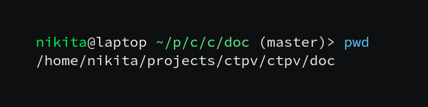
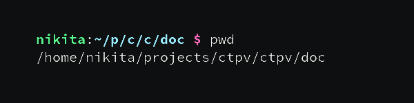

# shortbashpwd

I'm kinda old fashioned and I still prefer bash.
But I tried using fish one day and
I liked how it printed current working directory by default.



The prompt doesn't take a half of a screen width
if you are working in some deeply nested directory
because names of all the directories (except for the last one) are
abbreviated.

I wanted to have a similar thing in bash,
so I made a script that does it:



## Dependencies

* bash
* sed

## Installation

### Manual

```sh
git clone https://github.com/NikitaIvanovV/shortbashpwd
cd shortbashpwd
sudo make install
```

After installing the script,
you have to add a few lines to your `.bashrc` file in order to
activate the script in your shell session on startup.
You can do it by running this:

```sh
make bashrc
```

It will add append [`bashrc.bash`](bashrc.bash) to your `.bashrc` and
replace `FILE` with a location where [`shortbashpwd.bash`](shortbashpwd.bash) was installed.

Uninstall with `sudo make uninstall`.

### AUR

If you are an Arch Linux user, you can install
[`shortbashpwd-git`](https://aur.archlinux.org/packages/shortbashpwd-git)
AUR package.

```sh
yay -S shortbashpwd-git
```

After installing the package, you will be asked to
run one command manually to finish the installation ([read why](#manual)):

```sh
cat /usr/share/shortbashpwd/bashrc.bash >> ~/.bashrc
```
